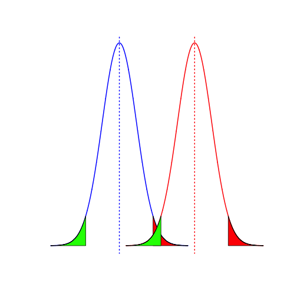

---
title       : Developing Data Products
subtitle    : An online Z test calculator and visual representation
author      : Ricky Tillson
job         : 
framework   : io2012        # {io2012, html5slides, shower, dzslides, ...}
highlighter : highlight.js  # {highlight.js, prettify, highlight}
hitheme     : tomorrow      # 
widgets     : mathjax       # {mathjax, quiz, bootstrap}
mode        : standalone    # {, draft, selfcontained}
knit        : slidify::knit2slides
--- 

### What the app is for

In market research often only the proportion, or percentage, of people rating a particular metric as 'Excellent' is reported.

These scores are often tracked over time and some times it is desirable to know if the score has moved 'significantly'.

The significance testing vairies with both the significance level (p-value) and whether the test should be 1 or 2 tailed - sometimes only if the score has decreased is it desirable to know if it is significant.

Certain projects also request testing vs. a target score - a 1 sample test. This is an indicator of whether the metric is truly different (2-tailed), above or below (1-tailed) the target.


### General maths behind the app

The app takes input from the widgets down the left hand side.

For the 2-sample test the following formulae are used.

$$P = \frac {( p_1*n_1 + p_2*n_2)}{n_1 + n_2}$$

$$SE = \sqrt{ P * (1 - P) * ( \frac{1}{n_1} + \frac{1}{n_2} ) }$$

$$z = \frac {(p_1 - p_2)}{SE}$$

For a 1-sample test these forumlae are used:

$$SE = \sqrt{ \frac {p * (1 - p)}{n} }$$

$$z = \frac {target - p}{SE}$$

--- .smallcode

### How this works in practice...

```r
# default variables for the 2-sample version of the shiny app being used here
score_1 <- 0.4 ; base_1 <- 200 ; score_2 <- 0.6 ; base_2 <- 300 ; tails2 <- 2 ; confidence2 <- 0.95
range2 <- qnorm(1 - (1 - confidence2) / 2)
p_2  <- ((base_1 * score_1) + (base_2 * score_2)) / (base_2 + base_1)
se_2 <- sqrt(p_2 * (1 - p_2) * ((1 / base_1) + (1 / base_2)))

# splitting each curve into 3 sections; these section then have x and y co-ordinates calculated
lcord.x1 <- c(score_1 - 4 * se_2, seq(score_1 - 4 * se_2, score_1 - range2 * se_2, length.out = 1000), score_1 - range2 * se_2) 
lcord.y1 <- c(0,dnorm(seq(score_1 - 4 * se_2, score_1 - range2 * se_2, length.out = 1000), score_1, se_2),0) 
mcord.x1 <- c(score_1 - range2 * se_2,seq(score_1 - range2 * se_2, score_1 + range2 * se_2 , length.out = 1000),score_1 + range2 * se_2)
mcord.y1 <- c(0,dnorm(seq(score_1 - range2 * se_2, score_1 + range2 * se_2, length.out = 1000), score_1, se_2),0)
ucord.x1 <- c(score_1 + range2 * se_2,seq(score_1 + range2 * se_2, score_1 + 4 * se_2, length.out = 1000),score_1 + 4 * se_2) 
ucord.y1 <- c(0,dnorm(seq(score_1 + range2 * se_2, score_1 + 4 * se_2, length.out = 1000), score_1, se_2),0)      
lcord.x2 <- c(score_2 - 4 * se_2,seq(score_2 - 4 * se_2, score_2 - range2 * se_2, length.out = 1000),score_2 - range2 * se_2) 
lcord.y2 <- c(0,dnorm(seq(score_2 - 4 * se_2, score_2 - range2 * se_2, length.out = 1000), score_2, se_2),0) 
mcord.x2 <- c(score_2 - range2 * se_2,seq(score_2 - range2 * se_2, score_2 + range2 * se_2 , length.out = 1000),score_2 + range2 * se_2)
mcord.y2 <- c(0,dnorm(seq(score_2 - range2 * se_2, score_2 + range2 * se_2, length.out = 1000), score_2, se_2),0)
ucord.x2 <- c(score_2 + range2 * se_2,seq(score_2 + range2 * se_2, score_2 + 4 * se_2, length.out = 1000),score_2 + 4 * se_2) 
ucord.y2 <- c(0,dnorm(seq(score_2 + range2 * se_2, score_2 + 4 * se_2, length.out = 1000), score_2, se_2),0)

# store the values used for the plot
x_1 <- seq(score_1 - 4 * se_2, score_1 + 4 * se_2, length.out = 3000) ; y_1 <- dnorm(x_1, score_1, se_2)
x_2 <- seq(score_2 - 4 * se_2, score_2 + 4 * se_2, length.out = 3000) ; y_2 <- dnorm(x_2, score_2, se_2)

# set the scale for the plot - how much to extand beyond the curves
scale2 <-((score_1 + 4 * se_2) - (score_1 - 4 * se_2)) / 20
l.limit2 <- if (x_1[1] - scale2 < x_2[1] - scale2) {x_1[1] - scale2} else {x_2[1] - scale2}  
u.limit2 <- if (x_1[3000] + scale2 > x_2[3000] + scale2) {x_1[3000] + scale2} else {x_2[3000] + scale2} 

# plot curve 1 in blue and curve 2 in red, add vertical lines at the relevenet means. The x-axis is scaled to minimize space around the curves
plot(x_1, y_1, xlim=c(l.limit2, u.limit2), type = "l", axes = F, main="", xlab = "", ylab = "", col = 'blue', lwd = 2) ; abline(v=score_1, lty=3, col = 'blue', lwd = 2)
lines(x_2, y_2, col = 'red', lwd = 2) ; abline(v=score_2, lty=3, col = 'red', lwd = 2)

# add the coloured segments to the curves to aid visualisation - uses the sections calculated above
polygon(lcord.x1, lcord.y1, col='green')
polygon(ucord.x1, ucord.y1, col='red')
polygon(lcord.x2, lcord.y2, col='green')
polygon(ucord.x2, ucord.y2, col='red')
```

 


--- 

### ... and the chart it produces
 


--- .smallcode

### The additional output

As well as prooducing a chart there is also code to confirm your base sizes, proportions target and signicicance level. It also states whether there is, or is not, a significant difference between the two sample, or between the sample are the target score.


```r
str1 <- paste('With a sample size of ', base_1, ' and a proportion of ', score_1, '% for sample 1,', sep = "")
str2 <- paste('and a sample size of ', base_2, ' and a proportion of ', score_2, '% for sample 2', sep = "")
str3 <- paste('sample 2 ',
    if (lcord.x1[1000] < ucord.x2[1] & ucord.x1[1] > lcord.x2[1000]) {
        ' IS NOT significantly different from '
    } else {
        ' IS significantly different from '}
    , 'sample 1 at the ', confidence2 * 100, '% significance level' , sep="")
cat(str1, str2, str3, sep = "\n")
```

```
## With a sample size of 200 and a proportion of 0.4% for sample 1,
## and a sample size of 300 and a proportion of 0.6% for sample 2
## sample 2  IS significantly different from sample 1 at the 95% significance level
```


